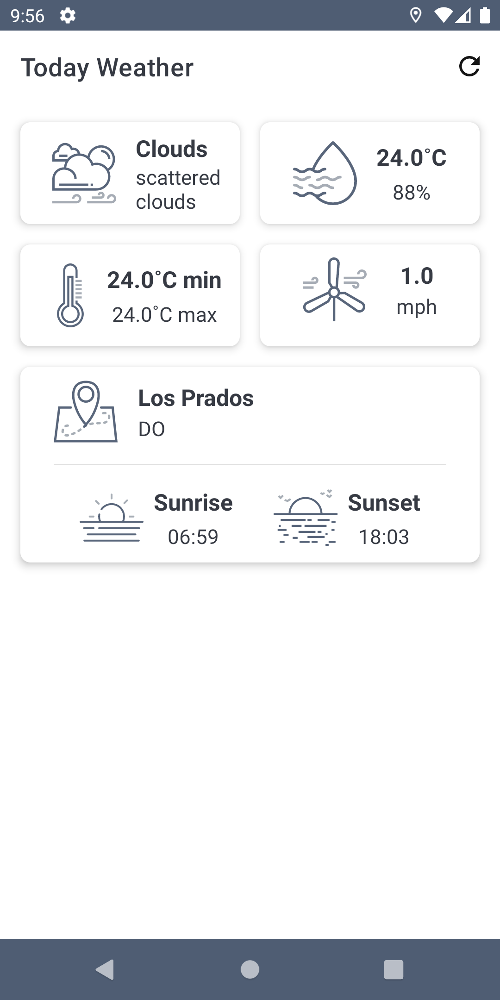

# Today Weather
[](https://android-arsenal.com/api?level=21)
[](https://kotlinlang.org)
[](https://opensource.org/licenses/Apache-2.0)

Weather data in a simple view based on modern Android application tech-stacks.

## Features
* Get latest weather data on app start.
* Refresh button to get latest weather data.
* Dialog warning when GPS or permissions are Off.
* Show last weather data when no internet connection.
* Spanish translation.



## Tech Stack & Open-source libraries
* Minimum SDK level 21.
* [Kotlin](https://kotlinlang.org/) - official programming language for Android development.
* [Coroutines](https://kotlinlang.org/docs/reference/coroutines-overview.html) - for asynchronous programming.
* [Android Architecture Components](https://developer.android.com/topic/libraries/architecture) - collection of libraries that help you design robust, testable, and maintainable apps.
  - [Data Binding](https://developer.android.com/topic/libraries/data-binding) - data objects to bind UI components in your layouts to data sources in your app.
  - [Lifecycle](https://developer.android.com/topic/libraries/architecture/lifecycle) - components to perform actions in response to a change in the lifecycle status of another component, such as activities and fragments.
* [Navigation](https://developer.android.com/guide/navigation) - interactions that allow users to navigate across, into, and back out from the different pieces of content within your app.
* [Fragment](https://developer.android.com/guide/components/fragments) - represents a behavior or a portion of user interface in a FragmentActivity.
* [Material-Components](https://github.com/material-components/material-components-android) - Material design components.
  - [Material Dialogs](https://github.com/afollestad/material-dialogs) - library with extensible dialogs API for Kotlin & Android.
* [Preference](https://developer.android.com/reference/androidx/preference/package-summary) - allows to build interactive settings screens, without needing to handle interacting with device storage or managing the user interface.
* [Dexter](https://github.com/Karumi/Dexter) - Library that simplifies the process of requesting permissions at runtime.
* [Retrofit](https://square.github.io/retrofit/) - A type-safe HTTP client for Android.
* [Play Services]()

## Build
In order to build and use the app you need to add your OpenWeatherMap API Key on the following line in the Constants.kt file. In order to get a Key see the following documentation [OpenWeatherMap](https://openweathermap.org/api).

```xml
const val API_KEY: String = "OPEN_WEATHER_API_KEY"
```

## Contribute
Awesome! If you would like to contribute you're always welcome!

# License
```xml
Copyright 2020 Anibal Ventura

Licensed under the Apache License, Version 2.0 (the "License");
you may not use this file except in compliance with the License.
You may obtain a copy of the License at

http://www.apache.org/licenses/LICENSE-2.0

Unless required by applicable law or agreed to in writing, software
distributed under the License is distributed on an "AS IS" BASIS,
WITHOUT WARRANTIES OR CONDITIONS OF ANY KIND, either express or implied.
See the License for the specific language governing permissions and
limitations under the License.
```
